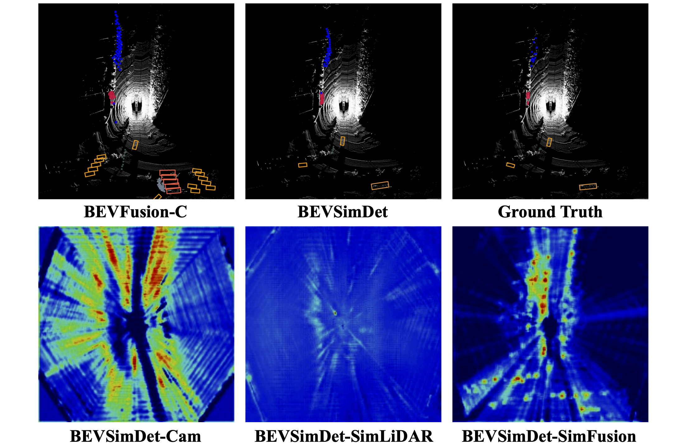

<h1 align="center">SimDistill: Simulated Multi-modal Distillation for BEV 3D Object Detection</h1>
<p align="center">
<a href="https://arxiv.org/abs/2303.16818">.svg" ></a>
<h4 align="center">This is the official repository of the paper <a href="https://arxiv.org/abs/2303.16818">SimDistill: Simulated Multi-modal Distillation for BEV 3D Object Detection</a>.</h4>
<h5 align="center"><em>Haimei Zhao, Qiming Zhang, Shanshan Zhao, Zhe Chen, Jing Zhang, and Dacheng Tao</em></h5>
<p align="center">
  <a href="#news">News</a> |
  <a href="#abstract">Abstract</a> |
  <a href="#method">Method</a> |
  <a href="#results">Results</a> |
  <a href="#preparation">Preparation</a> |
  <a href="#code">Code</a> |
  <a href="#statement">Statement</a>
</p>

## News
- **(2023/3/29)** SimDistill is accepted by AAAI 2024!.
- **(2023/3/29)** BEVSimDet is released on [arXiv](https://arxiv.org/abs/2303.16818).

> Other applications of [ViTAE Transformer](https://github.com/ViTAE-Transformer/ViTAE-Transformer) include: [image classification](https://github.com/ViTAE-Transformer/ViTAE-Transformer/tree/main/Image-Classification) | [object detection](https://github.com/ViTAE-Transformer/ViTAE-Transformer/tree/main/Object-Detection) | [semantic segmentation](https://github.com/ViTAE-Transformer/ViTAE-Transformer/tree/main/Semantic-Segmentation) | [pose estimation](https://github.com/ViTAE-Transformer/ViTPose) | [remote sensing](https://github.com/ViTAE-Transformer/ViTAE-Transformer-Remote-Sensing)｜[image matting](https://github.com/ViTAE-Transformer/ViTAE-Transformer-Matting) | [scene text spotting](https://github.com/ViTAE-Transformer/ViTAE-Transformer-Scene-Text-Detection)


## Abstract

Multi-view camera-based 3D object detection has become popular due to its low cost, but accurately inferring 3D geometry solely from camera data remains challenging and may lead to inferior performance. Although distilling precise 3D geometry knowledge from LiDAR data could help tackle this challenge, the benefits of LiDAR information could be greatly hindered by the significant modality gap between different sensory modalities. To address this issue, we propose a \textbf{Si}mulated \textbf{m}ulti-modal \textbf{Distill}ation (\textbf{SimDistill}) method by carefully crafting the model architecture and distillation strategy. Specifically, we devise multi-modal architectures for both teacher and student models, including a LiDAR-camera fusion-based teacher and a simulated fusion-based student. Owing to the ``identical'' architecture design, the student can mimic the teacher to generate multi-modal features with merely multi-view images as input, where a geometry compensation module is introduced to bridge the modality gap. Furthermore, we propose a comprehensive multi-modal distillation scheme that supports intra-modal, cross-modal, and multi-modal fusion distillation simultaneously in the Bird's-eye-view space. Incorporating them together, our SimDistill can learn better feature representations for 3D object detection while maintaining a cost-effective camera-only deployment. Extensive experiments validate the effectiveness and superiority of SimDistill over state-of-the-art methods, achieving an improvement of 4.8\% mAP and 4.1\% NDS over the baseline detector.
## Method


## Results

### Quantitative results on Nuscenes validation set

### Qualitative results



## Preparation

### Prerequisites

The code is built with following libraries:

- Python >= 3.8, \<3.9
- OpenMPI = 4.0.4 and mpi4py = 3.0.3 (Needed for torchpack)
- Pillow = 8.4.0 (see [here](https://github.com/mit-han-lab/bevfusion/issues/63))
- [PyTorch](https://github.com/pytorch/pytorch) >= 1.9, \<= 1.10.2
- [tqdm](https://github.com/tqdm/tqdm)
- [torchpack](https://github.com/mit-han-lab/torchpack)
- [mmcv](https://github.com/open-mmlab/mmcv) = 1.4.0
- [mmdetection](http://github.com/open-mmlab/mmdetection) = 2.20.0
- [nuscenes-dev-kit](https://github.com/nutonomy/nuscenes-devkit)

After installing these dependencies, please run this command to install the codebase:

```bash
python setup.py develop
```
### Data Preparation

#### nuScenes

Please follow the instructions from [here](https://github.com/open-mmlab/mmdetection3d/blob/master/docs/en/datasets/nuscenes_det.md) to download and preprocess the nuScenes dataset. Please remember to download both detection dataset and the map extension (for BEV map segmentation). After data preparation, you will be able to see the following directory structure (as is indicated in mmdetection3d):

```
mmdetection3d
├── mmdet3d
├── tools
├── configs
├── data
│   ├── nuscenes
│   │   ├── maps
│   │   ├── samples
│   │   ├── sweeps
│   │   ├── v1.0-test
|   |   ├── v1.0-trainval
│   │   ├── nuscenes_database
│   │   ├── nuscenes_infos_train.pkl
│   │   ├── nuscenes_infos_val.pkl
│   │   ├── nuscenes_infos_test.pkl
│   │   ├── nuscenes_dbinfos_train.pkl

```

## Code
### Setup
```bash
python setup.py develop
```
### Training
```bash
different loss items should be changed in configs/nuscenes/det/centerhead/lssfpn/camera/256x704/swint/convfuser.yaml

and different backbone networks can be choosed, including swinT, vitaev2, and bevformer in configs/nuscenes/det/centerhead/lssfpn/camera/256x704/

torchpack dist-run -np 8 python tools/train.py configs/nuscenes/det/centerhead/lssfpn/camera/256x704/swint/convfuser.yaml --data.samples_per_gpu 3 --max_epochs 20 --data.workers_per_gpu 6 --run-dir swinT-twobranchesloss --load_from ../bevfusion-main/pretrained/bevfusion-det.pth
```
### Evaluation
```bash
torchpack dist-run -np 8 python tools/test.py configs/nuscenes/det/centerhead/lssfpn/camera/256x704/swint/convfuser.yaml --xxx.pth --eval bbox
```

## Statement
@article{zhao2023bevsimdet,  
  title={BEVSimDet: Simulated Multi-modal Distillation in Bird's-Eye View for Multi-view 3D Object Detection},  
  author={Zhao, Haimei and Zhang, Qiming and Zhao, Shanshan and Zhang, Jing and Tao, Dacheng},  
  journal={arXiv preprint arXiv:2303.16818},  
  year={2023}  
}  

or

@inproceedings{zhao2024simdistill,
title={SimDistill: Simulated Multi-Modal Distillation for BEV 3D Object Detection},

author={Zhao, Haimei and Zhang, Qiming and Zhao, Shanshan and Chen, Zhe and Zhang, Jing and Tao, Dacheng},

booktitle={Proceedings of the AAAI Conference on Artificial Intelligence},

volume={38},

number={7},

pages={7460--7468},

year={2024}

}

